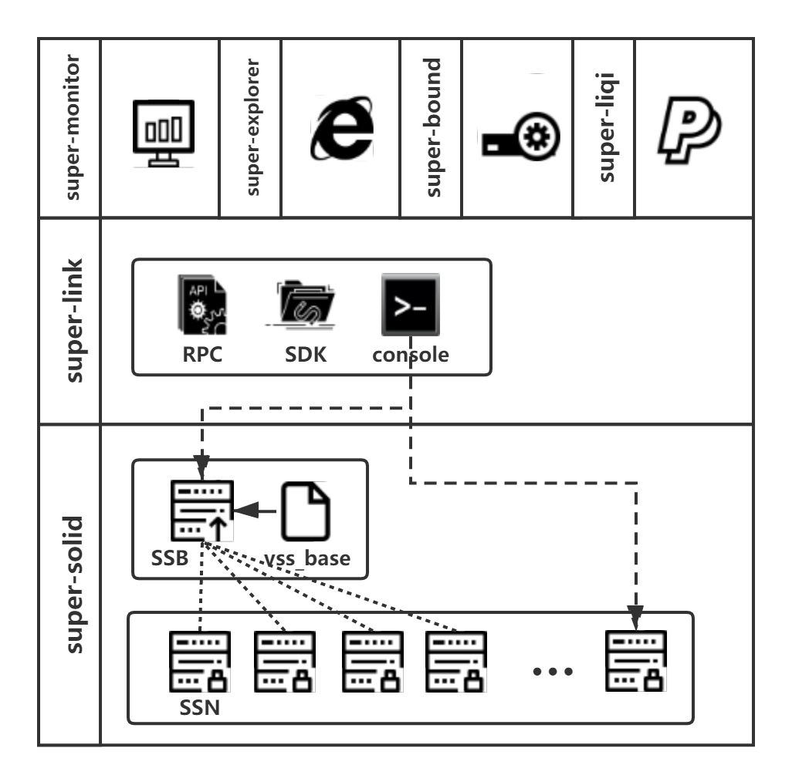

平台介绍
--------------------------

什么是墨珩联盟链平台
>>>>>>>>>>>>>>>>>>>>>>>>>>

.. |br| raw:: html

     

|br|

|br|

墨珩联盟链平台，以下简称联盟链平台，是由墨珩网络科技有限公司发布的新一代联盟链产品。由底层联盟链、通用中间间件平台、通用服务和通用产品组成。

底层联盟链（Super-Solid），采用自主研发的双层双控技术，使用BLS共识模式，内嵌收费模块，可快速部署，快速使用。 具体参见 :doc:`联盟链部署 <./Supersolid/index>` 。

通用中间件平台(Super-Link)，主要提供联盟链所需交互接口，当前由三种类型的方式：

- console方式： 在联盟链节点服务器上直接打开命令行交互，是一种开发模式的调试方式，具体参见 :doc:`联盟链命令行介绍 <./Interface/Console>` 。

- rpc方式： 通过rpc接口连接联盟链，具体参见 :doc:`联盟链RPC介绍 <./Interface/Rpc>` 。

- sdk方式： 安装联盟链sdk安装包，使用客户端方式交互，当前仅提供nodejs的sdk，具体参见 :doc:`联盟链SDK介绍 <./Interface/Sdk>` 。

通用服务指的是显示联盟链内部数据的服务工具，当前主要有：

- 联盟链通用浏览器(Super-Explorer)： 显示联盟链运行数据的通用浏览器，具体参见 :doc:`联盟链浏览器 <./Explorer>` 。

- 联盟链监控平台(Super-Monitor)： 显示联盟链节点数据，并在权限范围内对联盟链进行监控和操作，具体参见 :doc:`联盟链监控 <./Monitor>` 。

通用产品是指基于联盟链开发的通用应用层工具，当前通用产品是墨珩超零界系统（Super-Bound）和墨珩快速支付系统（Super-Liqi），此部分将单独列章介绍。

面向对象
>>>>>>>>>>>>>>>>>>>>>>>>>>
本文档面向的对象是有一定技术基础的开发人员，我们力求从技术开发的角度将整个联盟脸平台描述清楚。

我们建议您在阅读文档前，首先阅读如下一些区块链基础知识，这将极大的帮助您更好的理解整个平台。

-
-

章节构成简介
>>>>>>>>>>>>>>>>>>>>>>>>>>
本章主要由联盟链的部署、联盟链的接口、联盟链监控和联盟链浏览器四部分组成。

如果您想自己部署墨珩联盟链，请参见 :doc:`联盟链部署 <./Supersolid/index>` 。

如果您已经部署了联盟链，想要查看联盟链的运行数据，请参见 :doc:`联盟链浏览器 <./Explorer>` 。

如果您已经部署了联盟链，想要监控节点数据，请参见 :doc:`联盟链监控 <./Monitor>` 。

如果您已经部署了联盟链，想要做二次开发，请参见 :doc:`联盟链中间件平台 <./Interface/index>` 。

