联盟链监控
-----------------------------

.. image:: ../imgs/Super-monitor.png
  :align: center

什么是监控
>>>>>>>>>>>>>>>>>>>>>>>>>>

墨珩联盟链监控(Super-Monitor)，以下简称监控，是墨珩联盟链平台的一个配套服务。在一个已经部署的联盟链上，可以快速部署这样一套监控系统来监控联盟链的数据。

监控系统有如下一些模块

- 账户模块，监控根据不同的登陆账号给出不同的权限
- 数据显示模块
- 图表模块
- 操作模块，主要收费续块和节点相关操作
- 报警模块
- 日志模块等

服务器配置推荐
>>>>>>>>>>>>>>>>>>>>>>>>>>

推荐2核2G服务器一台，40G硬盘。

推荐监控服务器和联盟链在同一网络环境下，可走内网。如果走外网，需要至少2M带宽。

监控部署
>>>>>>>>>>>>>>>>>>>>>>>>>>

**强烈建议安装在Ubuntu中**

部署前需要安装的软件
::::::::::::::::::::::::::

在部署监控前，以下软件必须安装

- node：https://npm.taobao.org/mirrors/node/v10.19.0/，推荐下载v10.19.0
- npm：node自带
- mongodb：https://www.mongodb.org/dl/linux
- pm2

程序包下载
::::::::::::::::::::::::::

联盟链监控的程序包可在如下连接中获取: |location_link| 。

.. |location_link| raw:: html

   <a href="https://www.baidu.com" target="_blank">监控程序包</a>

依赖包安装
::::::::::::::::::::::::::

解压程序包到安装目录下，并执行
::
    npm install

修改配置文件
::::::::::::::::::::::::::

**Mongodb配置**

配置根目录下Mongodb文件config.json

- mongoHost：mongo IP地址
- mongouname：mongo用户名 
- mongopasswd：mongo密码
- dbname：mongo库名称

**Monitor配置**

- baseAddress：SSB vss_base地址，具体参见  :ref:`联盟链部署2 <vssbase>` 

- ssb->list：SSB服务列表
- ssb->list->name：SSB显示名称
- ssb->list->host：SSB服务器rpc的IP，具体参见  :ref:`联盟链部署1.2 <ssbrpc>`
- ssb->list->rpcPort：SSB服务器rpc端口
- ssb->list->show：服务器监控信息是否展示（1：展示，0：不展示）
- ssb->list->username：服务器登录用户名
- ssb->list->serverPrivateKey：服务器私钥文件（在项目routes目录下，若每台服务器私钥不一样需要对应不同的名称），私钥文件产生方式参见 :ref:`监控相关设置 <monitor>`
- ssb->list->scriptPath：SSB服务器Monitor脚本文件夹(monitor-scripts)路径

- ssn->list：SSN服务列表
- ssn->list->name：SSN显示名称
- ssn->list->host：SSN服务器rpc的IP，具体参见  :ref:`联盟链部署3.1 <ssnrpc>`
- ssn->list->rpcPort：SSN服务器rpc端口
- ssn->list->show：服务器监控信息是否展示（1：展示，0：不展示）
- ssn->list->username：服务器登录用户名
- ssn->list->serverPrivateKey：服务器私钥文件（在项目routes目录下，若每台服务器私钥不一样需要对应不同的名称），私钥文件产生方式参见 :ref:`监控相关设置 <monitor>`
- ssn->list->scriptPath：SSN服务器Monitor脚本文件夹(monitor-scripts)路径
- ssn->list->nodePath：节点文件夹路径

- html->name：页面左菜单显示的名称
- html->chart_url:页面图表嵌入的网址

启动并查看监控
::::::::::::::::::::::::::

输入如下命令启动监控
::
    pm2 start app.js

至此，可在 http:本机ip:3002 查看监控。

监控的信息介绍
>>>>>>>>>>>>>>>>>>>>>>>>>>

账户信息
::::::::::::::::::

- 余额显示
- 账户keystore
- 退出

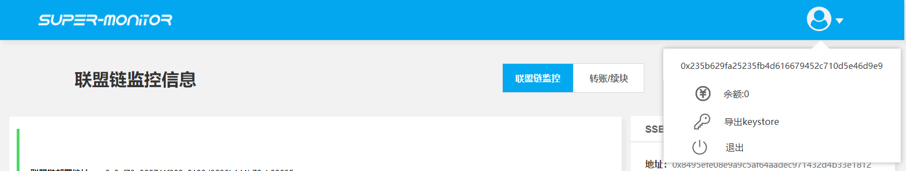
  
其他信息
::::::::::::::::::

- SSB相关信息展示
- SSN相关信息展示
- Monitor相关信息展示
- 日志展示

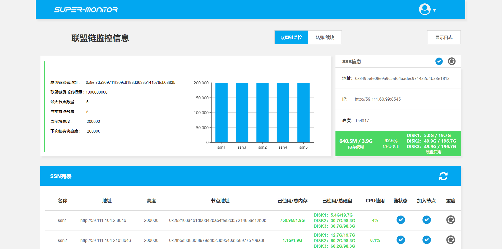
  
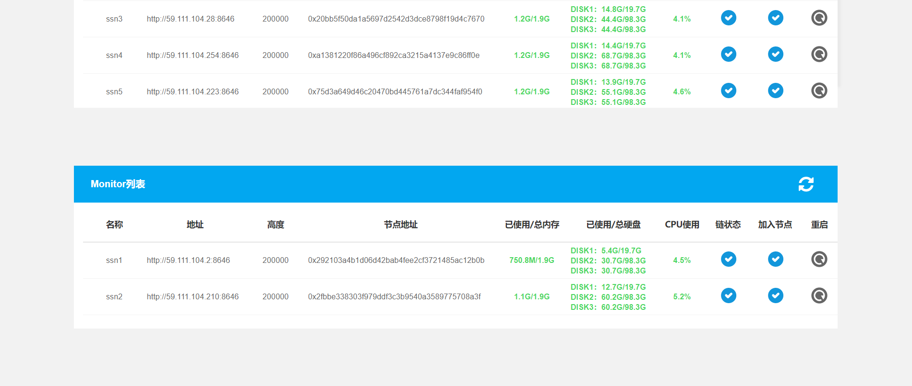
  
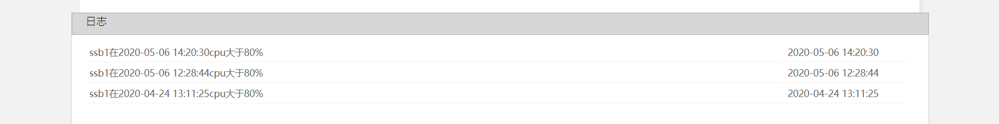
  
监控的使用介绍
>>>>>>>>>>>>>>>>>>>>>>>>>>

转账
::::::::::::::::::

- 账户之间的Token互转

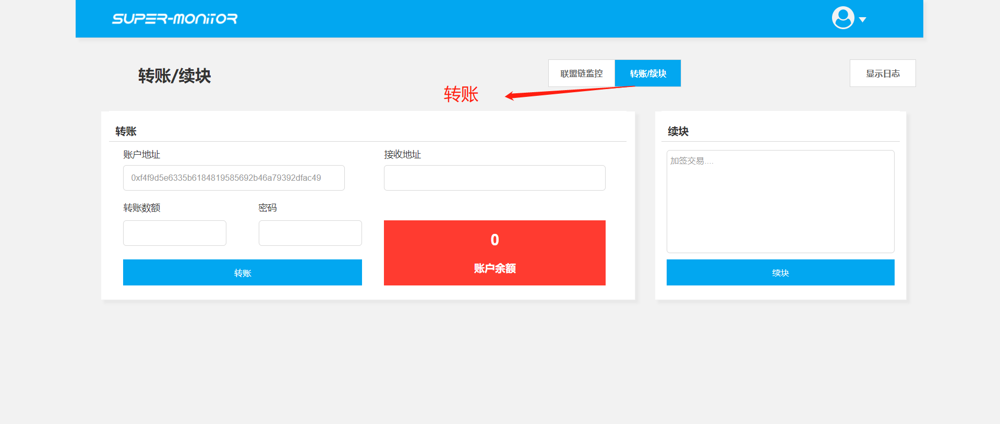

续块
::::::::::::::::::

- 联盟链运行需要进行续块操作，当联盟链达到下次续块高度后就会停止，需要在此处进行续块操作。

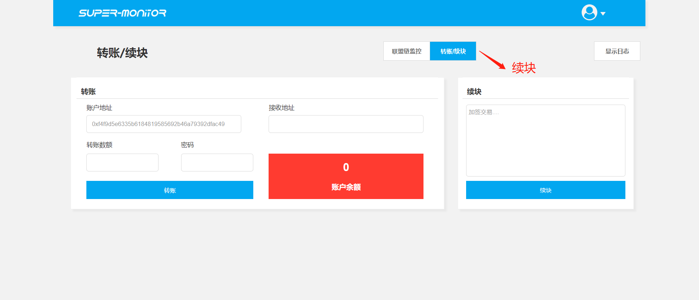

节点添加
::::::::::::::::::

**联盟链拥有者**

- 节点添加操作

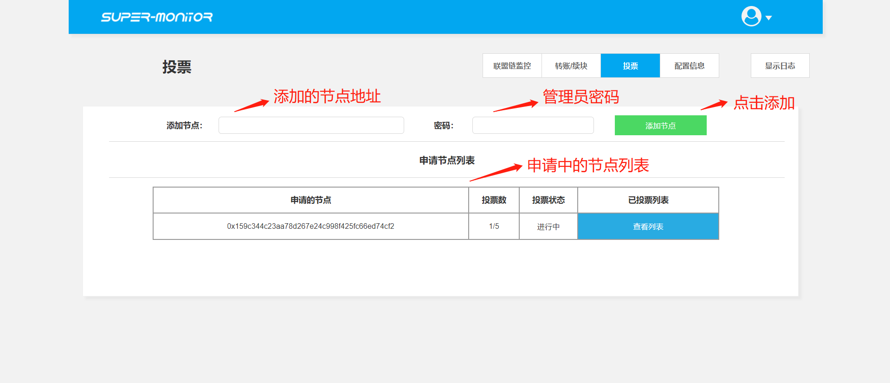
 
- 查看已投票节点账户列表
 
.. image:: ../imgs/monitor-8.png
  :align: center

**老节点方**

- 查看节点申请列表

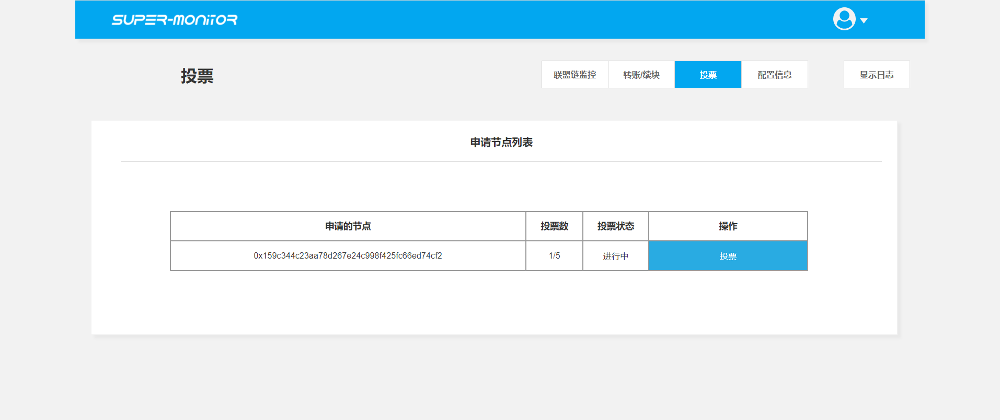
  
- 投票操作

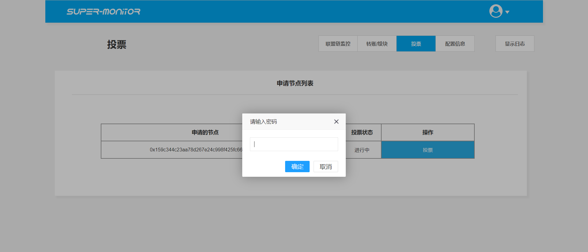

**新节点方**

- 查看当前申请节点的投票状态

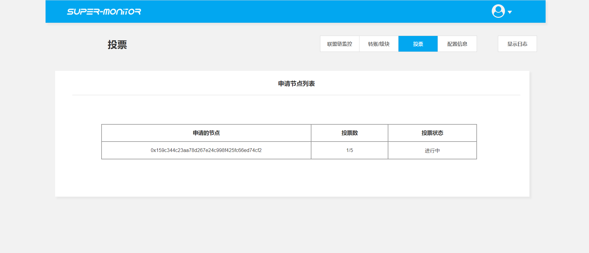
  
配置文件
::::::::::::::::::

- 更新当前节点配置文件

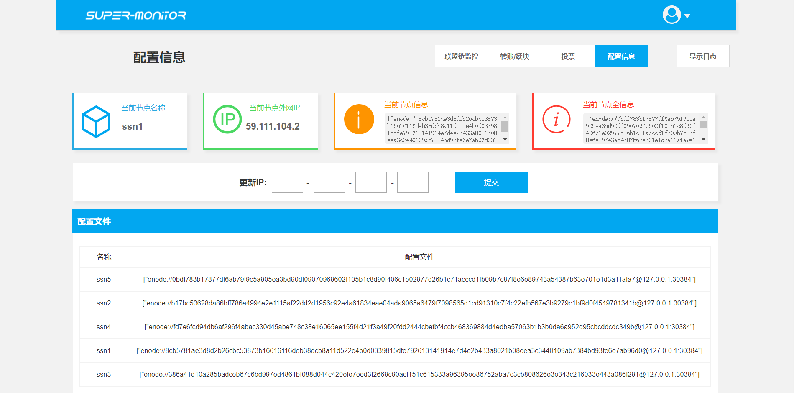

重启节点
::::::::::::::::::

- 联盟链拥有者可以重启所有节点程序，节点账户可重启当前自己的节点程序。

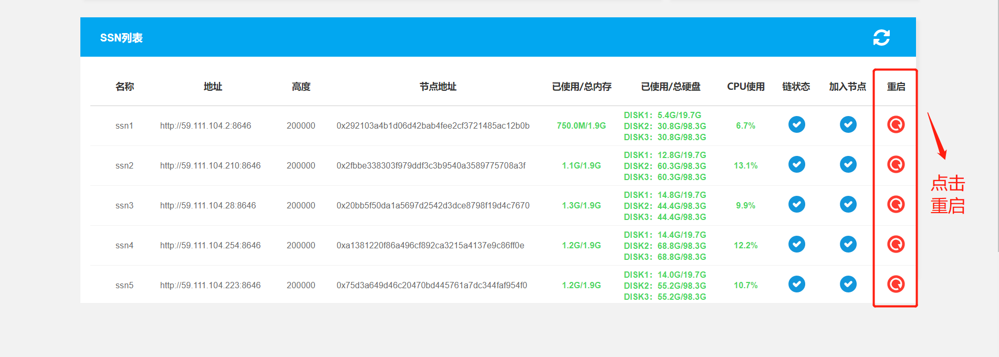

